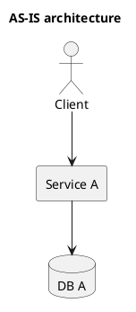
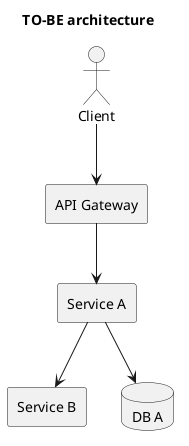

# Архитектурные решения

## Цель документа
Зафиксировать архитектурные схемы (текущие и целевые), ключевые технические решения и официальное заключение архитектора.

## 1. Текущая архитектура (AS-IS)

### 1.1 Схема
- Файл PlantUML: `TO-DO/architecture_as_is.puml`
- Рендер (опционально): `TO-DO/architecture_as_is.png`

### 1.2 Краткое пояснение
- TO-DO

## 2. Целевая архитектура (TO-BE)

### 2.1 Схема
- Файл PlantUML: `TO-DO/architecture_to_be.puml`
- Рендер (опционально): `TO-DO/architecture_to_be.png`

### 2.2 Краткое пояснение
- TO-DO

## 3. Ключевые архитектурные решения

| ID | Решение | Альтернативы | Почему выбрано | Влияние/риски |
|---|---|---|---|---|
| ADR-001 | TO-DO | TO-DO | TO-DO | TO-DO |

## 4. Влияние на смежные системы
- TO-DO

## 5. Нефункциональные последствия
- Производительность: TO-DO
- Надежность: TO-DO
- Безопасность: TO-DO
- Масштабируемость: TO-DO

## 6. Заключение архитектора
- TO-DO

## 7. TO-DO checklist

- [ ] Приложены схемы AS-IS и TO-BE.
- [ ] Для схем приложены `.puml` исходники.
- [ ] Описаны ключевые решения и альтернативы.
- [ ] Зафиксировано заключение архитектора.
