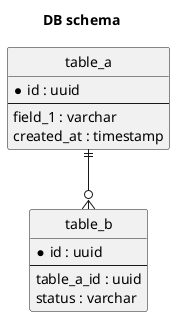

# Схема БД

## Цель документа
Подробно описать структуру хранения данных, связи между сущностями и изменения схемы БД в рамках микросервиса.

## 1. Диаграмма
- Файл PlantUML: `TO-DO/db_schema.puml`
- Рендер (опционально): `TO-DO/db_schema.png`

## 2. Описание таблиц

| Таблица | Назначение | Комментарий |
|---|---|---|
| TO-DO | TO-DO | TO-DO |

## 3. Колонки таблиц

### 3.1 `название_таблицы`

| Столбец | Тип | Ключ | Обязателен | Значение по умолчанию | Описание |
|---|---|---|---|---|---|
| TO-DO | TO-DO | TO-DO | TO-DO | TO-DO | TO-DO |

## 4. Индексы и ограничения
- TO-DO

## 5. Миграции

| Версия | Изменение | Скрипт/PR | Обратная совместимость |
|---|---|---|---|
| TO-DO | TO-DO | TO-DO | TO-DO |

## 6. TO-DO checklist

- [ ] Подготовлена диаграмма.
- [ ] Приложен `.puml` исходник диаграммы.
- [ ] Сформировано описание таблиц и столбцов.
- [ ] Зафиксированы ограничения и миграции.
