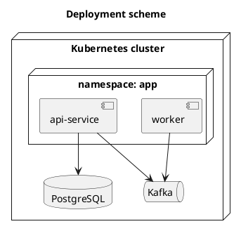

# Схема развертывания

## Цель документа
Зафиксировать схему развертывания микросервиса и инфраструктурные зависимости.

## 1. Схема
- Файл PlantUML: `TO-DO/deployment_scheme.puml`
- Рендер (опционально): `TO-DO/deployment_scheme.png`

## 2. Окружения

| Окружение | Namespace/Cluster | Особенности конфигурации |
|---|---|---|
| dev | TO-DO | TO-DO |
| stage | TO-DO | TO-DO |
| prod | TO-DO | TO-DO |

## 3. Компоненты развертывания

| Компонент | Тип (service/deployment/job) | Ресурсы | Реплики |
|---|---|---|---|
| TO-DO | TO-DO | TO-DO | TO-DO |

## 4. Сетевые зависимости
- TO-DO

## 5. CI/CD и релизный процесс
- TO-DO

## 6. План отката
- TO-DO

## 7. TO-DO checklist

- [ ] Приложена актуальная схема развертывания.
- [ ] Приложен `.puml` исходник схемы.
- [ ] Описаны окружения и конфигурации.
- [ ] Описан план отката.
