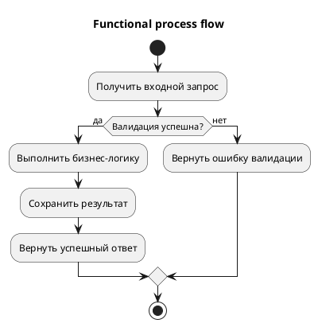

# Функциональные требования

## 1. История изменений

| Версия | Описание изменений | Автор | Дата | Ревизия | Релиз | Задача |
|---|---|---|---|---|---|---|
| 1.0 | Первая версия документа | TO-DO | TO-DO | TO-DO | TO-DO | TO-DO |

## 2. Общие сведения

| Поле | Значение |
|---|---|
| Наименование фичи/изменения | TO-DO |
| Контур/домен | TO-DO |
| Инициатор | TO-DO |
| Цель | TO-DO |

## 3. Связанные документы

| Документ | Ссылка | Версия | Комментарий |
|---|---|---|---|
| Бизнес-требования | TO-DO | TO-DO | TO-DO |
| Архитектурные решения | TO-DO | TO-DO | TO-DO |
| Интеграции | TO-DO | TO-DO | TO-DO |

## 4. Ограничения и допущения
- TO-DO

## 5. Схема процесса
- Файл PlantUML: `TO-DO/process_flow.puml`
- Рендер (опционально): `TO-DO/process_flow.png`

## 6. Сценарии

### 6.1 Основной сценарий
- TO-DO

### 6.2 Альтернативные сценарии
- TO-DO

## 7. Функциональные требования

| ID | Требование | Приоритет | Источник | Критерий приемки |
|---|---|---|---|---|
| FR-001 | TO-DO | TO-DO | TO-DO | TO-DO |

## 8. Валидации

| Поле/контекст | Проверка | Сообщение об ошибке |
|---|---|---|
| TO-DO | TO-DO | TO-DO |

## 9. Ошибки и исключения

| Код/тип | Условие | Поведение системы |
|---|---|---|
| TO-DO | TO-DO | TO-DO |

## 10. Открытые вопросы
- TO-DO

## 11. TO-DO checklist

- [ ] Заполнена история изменений.
- [ ] Описаны сценарии и требования с критериями приемки.
- [ ] Описаны валидации и обработка ошибок.
