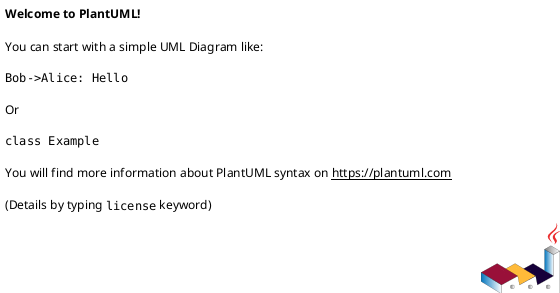

# business_requirements

## Цель сервиса
- Почему сервис/функция нужна бизнесу.
- Какой бизнес эффект дает.
- Какой KPI подтверждает ценность.

## Роли и сценарии
- Инициатор / владелец процесса.
- Основной пользовательский путь.
- Ключевые альтернативные сценарии.

## Бизнес-правила
- Правила принятия решений.
- Правила приоритетов и очередности операций.
- Неподдерживаемые/запрещённые сценарии.

## Границы и интерфейсы
- Что входит в зону ответственности сервиса.
- Что делается в смежных системах (out of scope).
- Нужен ли ручной режим управления.

## Что должно быть проверено
- Набор позитивных и негативных сценариев для каждого важного процесса.
- Минимальный набор тестовых кейсов.

## PlantUML (необязательно)

