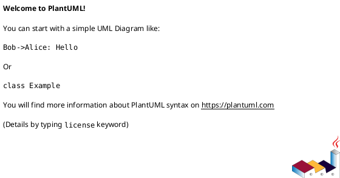

# external_integrations

## Внешние зависимости
- Сторонние провайдеры и их ответственность.
- Точки отказа и обязательные SLA по внешним системам.
- Требования к доступам и аутентификации.

## Сценарии взаимодействия
- Какие события инициируют вызов внешней интеграции.
- Обязательные и необязательные поля.
- Формат ошибок и их последующая обработка.

## Безопасность интеграции
- Формы авторизации, ротация секретов, ip allow-list.
- Нормы шифрования/подписи/маскирования чувствительных полей.

## Резервирование и деградации
- Как сервис ведет себя, если внешний контур недоступен.
- Очереди, retry и fallback-путь.

## PlantUML

