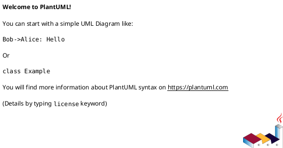

# internal_integrations

## Карта внутренних интеграций
- Сервис-потребитель / владелец данных.
- Канал обмена: API, база, очередь, shared schema.
- Целевая частота и критичность обмена.

## Контракты
- Точки вызова, методы, versioning.
- Формат запроса/ответа (основные поля).
- Таймауты и политика повторов.

## Управление изменениями контрактов
- Как согласуются изменения.
- Какие проверки нужны до выката.
- Как обеспечивается обратная совместимость.

## Наблюдаемость в связке
- Какие метрики/логи нужны на уровне интеграции.
- Что должно попадать в трассировку.

## PlantUML

