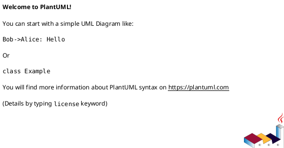

# logging

## Что логируем
- Ключевые события бизнес-процессов.
- Техсобытия (старт/завершение операций, ошибки валидации, retries).

## Корреляция и трассировка
- Корреляционный идентификатор в сквозном потоке.
- Привязка к пользователю/запросу.

## Политики хранения логов
- Формат и обязательные поля.
- Уровни логирования по окружениям.
- Ограничения на чувствительные поля.

## PlantUML (необязательно)

