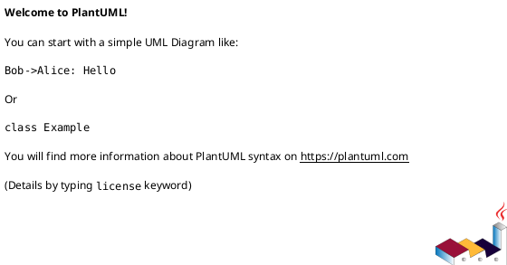

# performance

## Нагрузка и профиль трафика
- Ожидаемое число RPS по операциям.
- Типовой и пиковый профиль нагрузки.
- Сезонность/периоды батчевых нагрузок.

## SLA и метрики
- Цели по latency (p95/p99) и availability per endpoint.
- Допустимые пороги деградации.
- Отдельно для чтения/записи и фоновых процессов.

## Тестирование производительности
- Набор нагрузочных тестов и сценарии.
- Длительность прогрева и пороговые значения стабильности.
- Как интерпретировать результаты.

## План оптимизации
- Горизонтальные/вертикальные пути.
- Что мониторится первым при деградации.
- Известные узкие места и план снятия.

## PlantUML (необязательно)

